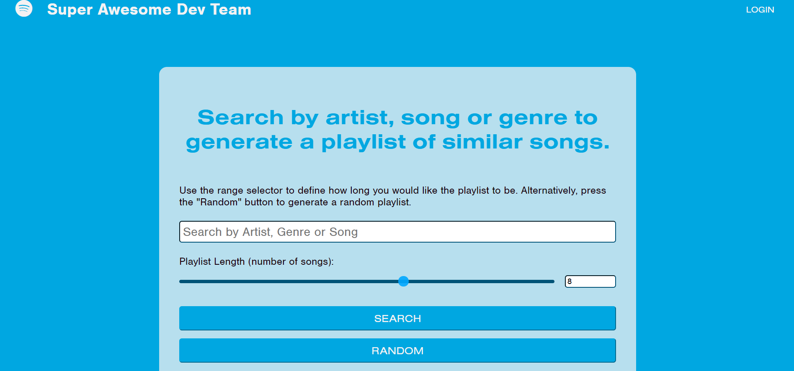

# Web Dev Team Awesome

## Table of contents
* [Aim](#Aim)
* [Challenges](#Challenges)
* [Prerequisites](#Prerequisites)
* [Pictures](#Pictures)
* [Collaborators](#collaborators)
* [Technologies](#technologies)

# General info :

**Github**
* https://github.com/ChrisOnions/webdevawesometeam

**Live Project**
* https://chrisonions.github.io/webdevawesometeam/
# Built With:

* HTML
* Css
* reset.css (Link in recources)
* Visual Studio Code

# Aim :

This project was our first Bootcamp Project and was focused on applying our newly acquired skills and knowledge to build a web application from scratch.

With a team, we conceived and executed a design that solves a real-world problem by integrating data received from multiple server-side API requests. Working collaboratively, we learned agile development methodologies, debugged and implemented various features using the git branch workflow and pull requests.

# Project Description:

A webpage that allows a user to search an artist, song or genre that they like, and then generate a playlist of similar songs through a Spotify API. The user will be able to define how long they would like the playlist to be. The webpage also features a "Recommended Cocktail" button, which, when clicked, will present the user with the name and instructions for a random cocktail that they can enjoy while listening to their new playlist.

# User Story:

[type of user...] As someone who is interested in music and always looking to hear new songs, [goal...] I want to easily be presented with a list of songs based off music I already know and enjoy [to achieve...] in order to expand my music experience and discover new music.

# Prerequisites :

Can be opened in any text editor workspace

Check browser extentions from blocking login process

# Example
* Visual studio code
* notepad++

# Requirements

Be interactive (i.e., accept and respond to user input).

Use at least two server-side APIs.

Does not use alerts, confirms, or prompts (use modals).

Use client-side storage to store persistent data.

Be responsive.

Have a polished UI.

Have a clean repository that meets quality coding standards 

# Collaborators

**Ty Saunders**
- Email - tysaunders1@hotmail.com
- Github - https://github.com/genkidesu

**Neil Roy**
- Email - neil.roy63@gmail.com
- Github - https://github.com/neilroy63

**Lauren Briggs**
- Email - laurenebriggs96@yahoo.com.au 
- Github - https://github.com/lauren-briggs

**Chris Onions**
- Email - C.onions101@gmail.com
- Github - https://github.com/ChrisOnions/

# Technologies
- FontAwesome
- Typekit
- JQuery
- Spotify
- The CocktailDB API

## Pictures :

